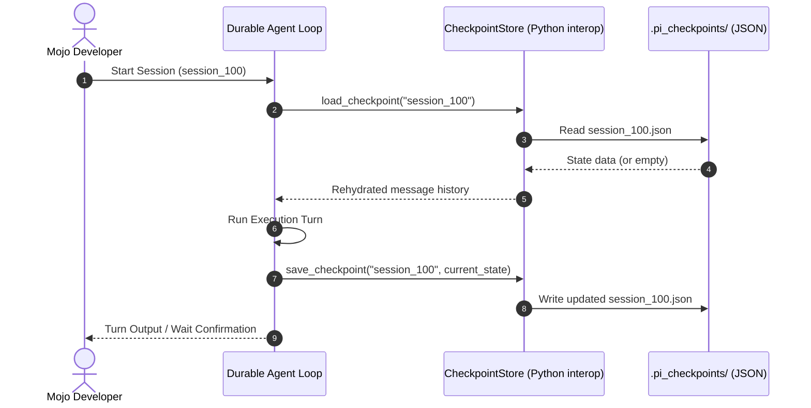

# 🎯 pi-mojo v0.2: Detailed Development Plan for Narratives & Durable Checkpointing

This document provides a detailed technical design, architectural plan, and implementation roadmap for:
1. **Narrative-Driven Refactoring (Examples 1–10)**: Embedding cohesive systems-level stories into the existing progressive examples.
2. **Durable State Checkpointing (`src/packages/durable/`)**: A persistent session-recovery engine using interop-based JSON serialization.

---

## 📖 Part 1: Narrative-Driven Refactoring (Examples 1–10)

Currently, the examples demonstrate framework capabilities without a unifying theme. To make `pi-mojo` an illustrative reference for compiled systems AI, each example is refactored around a concrete **systems-engineering narrative** (a story). This highlights why compiled performance and low-level interop are required.

### Detailed Narrative Specifications

#### 🤖 Example 1: Progressive AI Completions & Chat
* **Story**: **The AI Systems Onboarding Assistant**
* **Scenario**: The developer starts a new project. The agent checks standard path environment variables, inspects the local shell profile, and guides the developer by generating a personalized configuration outline.
* **Modifications**:
  * Refactor `examples/example_1_basic_ai/README.md` to document the environment verification context.
  * Update `examples/example_1_basic_ai/example_basic_ai.mojo` prompts to request onboarding diagnostics output.

#### 💻 Example 2: Systems Coding Agent
* **Story**: **The Automated Git Repository Sanitizer**
* **Scenario**: The repository has uncommitted temporary logs and lockfiles. The agent spawns commands natively to identify unstaged files, clean up temporary lockfiles, and stage changes.
* **Modifications**:
  * Refactor `examples/example_2_coding_agent/README.md` to document git staging safety.
  * Update `examples/example_2_coding_agent/example_coding_agent.mojo` default task to git staging actions.

#### 🔧 Example 3: Native AI Tool Calling
* **Story**: **The Operations Thermal Stress Monitor**
* **Scenario**: The agent monitors simulated server cluster temperature metrics and calculates cooling loads. It calls native compiled Mojo tools to perform fast math and fetch sensor inputs, making system adjustment recommendations.
* **Modifications**:
  * Refactor `examples/example_3_tool_calling/README.md` to map weather lookup to datacenter sensor monitoring.
  * Update `examples/example_3_tool_calling/example_tool_calling.mojo` functions to `get_server_temperature` and `calculate_heat_dissipation`.

#### 🌊 Example 4: Real-Time AI Event Streaming
* **Story**: **The Continuous Log Auditor Stream**
* **Scenario**: The system is processing high-throughput syslog entries. The agent streams tokens from Gemini, scanning standard log formats in real time and highlighting alert categories as they print.
* **Modifications**:
  * Refactor `examples/example_4_event_stream/README.md` to focus on streamed security log analysis.
  * Update `examples/example_4_event_stream/example_event_stream.mojo` prompts to format live log alerts.

#### ⚡ Example 5: GPU-Accelerated Hardware Analytics
* **Story**: **The GPU Stress & Throughput Analyzer**
* **Scenario**: The system needs to choose an analytical pipeline. The agent dispatches parallel classifications natively to the GPU, benchmarking CPU serial times against parallel GPU dispatch under high load.
* **Modifications**:
  * Refactor `examples/example_5_gpu_analytics/README.md` to frame the benchmark as hardware selection diagnostics.
  * Update `examples/example_5_gpu_analytics/example_gpu_analytics.mojo` logs to display hardware stress outputs.

#### 🌐 Example 6: Concurrent Multi-URL Web Researcher
* **Story**: **The Competitor Package Intel Aggregator**
* **Scenario**: A systems team needs to track concurrent release logs. The agent spawns thread pools to pull documentation from three concurrent packages, extracting API updates and compiling a consolidated change report.
* **Modifications**:
  * Refactor `examples/example_6_web_researcher/README.md` to represent competitor package scraping.
  * Update `examples/example_6_web_researcher/example_web_researcher.mojo` default targets to programming package release boards.

#### 🔍 Example 7: Codebase Semantic Auditor & Refactoring Agent
* **Story**: **The Lifecycle Leak and File-Descriptor Auditor**
* **Scenario**: The project has unclosed file handles. The agent crawls the codebase, extracting zero-copy `StringView` slices of unmanaged resource lifecycles, and creates a patching plan.
* **Modifications**:
  * Refactor `examples/example_7_codebase_auditor/README.md` to document resource lifecycle audits.
  * Update `examples/example_7_codebase_auditor/example_codebase_auditor.mojo` target files to mock lifecycle routines.

#### 🔁 Example 8: Long-Running Coder Agent
* **Story**: **The Code Migration & Syntax Correction Assistant**
* **Scenario**: A project contains deprecated package signatures. The agent executes in a persistent loop, compiling the code, capturing compiler errors, and refactoring the signatures step-by-step until the build is clean.
* **Modifications**:
  * Refactor `examples/example_8_long_running_coder/README.md` to describe deprecation correction loops.
  * Update `examples/example_8_long_running_coder/example_long_running_coder.mojo` code task to refactoring actions.

#### 💓 Example 9: Local LLM Service Heartbeat Check
* **Story**: **The Cluster Database Recovery Monitor**
* **Scenario**: A local database interface on port 1234 is unstable. The agent executes diagnostic connection queries and round-trip timing checks, running native recovery commands if service latency thresholds are exceeded.
* **Modifications**:
  * Refactor `examples/example_9_local_heartbeat/README.md` to map LLM checks to active system recovery metrics.
  * Update `examples/example_9_local_heartbeat/example_local_heartbeat.mojo` logs to reflect active cluster restoration.

#### 🔄 Example 10: Towards Full-Fledged Agentic Loops
* **Story**: **The Continuous Integration Self-Healing Daemon**
* **Scenario**: A background ticking daemon monitors directory logs. It intercepts failing compile logs, patches incorrect syntax, and validates build completions autonomously.
* **Modifications**:
  * Refactor `examples/example_10_full_fledged_agent/README.md` to describe a background CI auto-patcher.
  * Update `examples/example_10_full_fledged_agent/example_full_fledged_agent.mojo` simulation to CI status checks.

---

## 🏗️ Part 2: Durable State Checkpointing (`packages/durable`)

To handle crashes, long timeouts, or human-in-the-loop pauses, we will implement state preservation via a new package: **`packages/durable/`**.



### Component Design

To avoid Mojo native String indexing or buffer allocation issues under interoperability casting, the durable checkpointing engine will utilize **Python's `json` module entirely via interop** for serialization, parsing, and file writes.

#### 1. `[pi_checkpoint_store.mojo](file:///Users/amund/pi-mojo/src/packages/durable/pi_checkpoint_store.mojo)` [NEW]
* **Purpose**: Manages serialized state snapshots on disk under `.pi_checkpoints/`.
* **State Schema**:
  ```json
  {
    "session_id": "session_100",
    "goal": "Migrate files",
    "timestamp": 1716634288000,
    "current_step": 3,
    "messages": [
      {"role": "user", "content": "Start migration"},
      {"role": "assistant", "content": "Running task..."}
    ],
    "metadata": {
      "model": "google/gemini-3.5-flash",
      "iterations": 2
    }
  }
  ```
* **API Specifications**:
  * `save_checkpoint(self, session_id: String, goal: String, current_step: Int, messages: PythonObject, metadata: PythonObject) raises`: Converts data to Python dict, stringifies using `json.dumps`, and writes using Python's `open()` file context.
  * `load_checkpoint(self, session_id: String) raises -> PythonObject`: Reads `.pi_checkpoints/<session_id>.json` using Python's `open().read()`, parses via `json.loads`, and returns a `PythonObject` representation.
  * `exists_checkpoint(self, session_id: String) -> Bool`: Confirms if `.pi_checkpoints/<session_id>.json` exists on disk.

#### 2. `[pi_durable_agent.mojo](file:///Users/amund/pi-mojo/src/packages/durable/pi_durable_agent.mojo)` [NEW]
* **Purpose**: Orchestrates checkpointing within standard agent workflows.
* **Design**:
  * Exposes `run_durable_task(self, session_id: String, goal: String, max_steps: Int) raises`.
  * Checks if `exists_checkpoint` is true. If so, it loads the history and rehydrates `current_state` (messages, step count).
  * Executes standard LLM query turns.
  * At the end of every successful execution iteration, it invokes `save_checkpoint` to commit state changes before spawning the next interop process.

---

## 🚀 Part 3: Example 12 Showcase

### `[example_durable_agent.mojo](file:///Users/amund/pi-mojo/examples/example_12_durable_agent/example_durable_agent.mojo)` [NEW]
* **Narrative**: **The Crash-Resilient Configuration Migrator**
* **Scenario**:
  1. The user launches the agent to migrate config structures across 3 folders.
  2. The agent executes the first step (migrating Folder 1) and saves a checkpoint.
  3. The runner artificially crashes/terminates itself to simulate a system failure.
  4. The user restarts the runner. The agent loads the checkpoint, skips Folder 1, directly processes Folder 2 and 3, and terminates successfully.

---

## 📅 Implementation Roadmap

```
Phase 1: Implement packages/durable/ (pi_checkpoint_store, pi_durable_agent)
   │
   ├── Phase 2: Refactor Examples 1–10 (Weave stories into READMEs and walkthroughs)
   │
   └── Phase 3: Create Example 12 (Durable agent runner & crash recovery demo)
```
