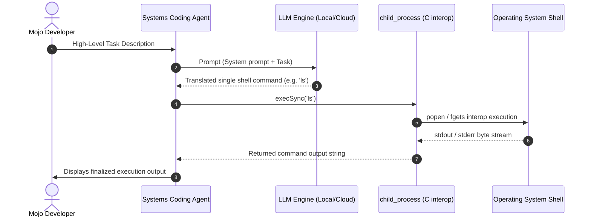

# ⚡ pi-mojo Technical Architecture & Structure

This document details the systems-level design, runtime architectures, interoperability boundaries, and code directory structure of `pi-mojo`.

---

## 🏗️ System Architecture Overview

`pi-mojo` unifies compiled, high-performance systems logic with dynamic agent loop execution. The diagram below illustrates how high-level packages compile down and map to kernel-level operating system boundaries via native C interop runtimes.

```mermaid
graph TD
    classDef mojo fill:#fbcfe8,stroke:#db2777,stroke-width:2px,color:#500724;
    classDef interop fill:#a5f3fc,stroke:#0891b2,stroke-width:2px,color:#083344;
    classDef kernel fill:#ddd,stroke:#555,stroke-width:2px,color:#111;

    subgraph Compiled Mojo Layer
        AI["AI Registry & Event Streams (packages/ai/)"]:::mojo
        Agent["Agent Loop & State Machine (packages/agent/)"]:::mojo
        Interpreter["Coding Agent Interpreter (packages/coding-agent/)"]:::mojo
    end

    subgraph Systems interop Layer (t2m_runtime)
        HTTP["http.mojo (Python urllib interop)"]:::interop
        FS["fs_pure.mojo (Caching FileSync POSIX system calls)"]:::interop
        CP["child_process.mojo (Unix popen interop)"]:::interop
        Utils["utils.mojo (SIMD scanning / Lifetimed StringView)"]:::interop
    end

    subgraph OS Kernel Layer
        libc["libSystem.B.dylib / libc.so"]:::kernel
        Darwin["Darwin (macOS) / Linux OS"]:::kernel
    end

    AI --> HTTP
    Agent --> CP
    Interpreter --> CP
    FS --> libc
    CP --> libc
    libc --> Darwin
```

---

## 🤖 Systems Coding Agent Execution Flow

The progressive `example_coding_agent.mojo` translates natural language tasks into terminal execution natively. Below is the sequence of transactions that occur at runtime when prompting the agent:



---

## ⚡ Technical Core Details

### 1. Systems-Level Runtime
This port implements systems-level integrations in `t2m_runtime` to support core operations without dynamic language wrappers where possible:
* **Kernel-Level File I/O**: Interacts with the filesystem via macOS/Unix C interop calls (`access`, `mkdir`, `rmdir`, `unlink`, `opendir`, `closedir` loaded from `libSystem.B.dylib`) and native `open()` channels.
* **Subprocess Spawning**: Executes command-line processes via C `popen`, `fgets`, and `pclose` system boundaries.

### 2. Concurrency Translation
Asynchronous flows and Promise sequences are mapped directly to Mojo's native cooperative concurrency model:
* Cooperative `async`/`await` functions mapped directly to co-routines.
* Promise chain unrolling resolving sequential arrow-closure callbacks into linear yields.
* Concurrent `Promise.all` mappings targeting background task groups.

### 3. Compiler Optimizations
* **Constant Folding**: Static binary and boolean expressions are simplified during lowering.
* **Dead Code Elimination (Tree-Shaking)**: Unused classes, functions, and interfaces are stripped from the compilation graph to minimize the final binary footprint.

---

## 📂 Repository Structure

The framework codebase is structured as a native Mojo package system located under `src/packages/` to match the exact design of the upstream TypeScript implementation.

```
├── src/                       # Centralized source directory
│   ├── t2m_runtime/           # Systems support library
│   │   ├── fs.mojo            # Pure native filesystem routines
│   │   ├── child_process.mojo # Native C interop subprocess execution via popen
│   │   ├── utils.mojo         # Promise models and type utilities
│   │   ├── path.mojo          # Path arithmetic and resolution
│   │   ├── http.mojo          # Native fetch and request handlers
│   │   └── date.mojo          # Native datetime mappings
│   ├── packages/              # Ported packages matching upstream architecture
│   │   ├── agent/             # Agent loop and state machine definitions
│   │   │   ├── pi_agent.mojo
│   │   │   ├── pi_agent_loop.mojo
│   │   │   └── pi_agent_types.mojo
│   │   ├── ai/                # AI providers, stream listeners, and API registry
│   │   │   ├── pi_ai_event_stream.mojo
│   │   │   ├── pi_ai_provider_faux.mojo
│   │   │   ├── pi_ai_registry.mojo
│   │   │   ├── pi_ai_stream.mojo
│   │   │   └── pi_ai_types.mojo
│   │   ├── coding-agent/      # Terminal inputs and shell interpreters
│   │   │   ├── pi_coding_bash.mojo
│   │   │   └── pi_coding_exec.mojo
│   │   ├── playbook/          # v0.2 Autonomous playbooks and self-improving registry
│   │   │   ├── pi_playbook_store.mojo
│   │   │   └── pi_playbook_agent.mojo
│   │   └── durable/           # v0.2 Durable checkpointing and state recovery
│   │       ├── pi_checkpoint_store.mojo
│   │       └── pi_durable_agent.mojo
│   └── benchmarks/            # Performance benchmarks
│       ├── example_benchmark.mojo # Performance benchmark performing 1,000 fs ops
│       └── benchmark_run.py   # Python runner for side-by-side benchmark execution
├── examples/                  # Progressive capability examples (Crawl, Walk, Run)
│   ├── example_1_basic_ai/    # Progressive completions and chat
│   ├── ...
│   ├── example_11_playbook_agent/ # Example 11: Playbook learning agent
│   ├── example_12_durable_agent/  # Example 12: Crash-resilient durable agent loop
│   └── example_13_autoresearch/   # Example 13: Basic Karpathy autoresearch loop
├── scenarios/                 # Complementary Real-World Systems Scenarios
│   ├── README.md              # Scenario hub index
│   ├── scenario_1_onboarding_assistant/  # Scenario 1: Developer onboarding
│   ├── ...
│   ├── scenario_10_ci_self_healer/       # Scenario 10: CI self-healing daemon
│   ├── scenario_11_deep_researcher/     # Scenario 11: Iterative deep research agent
│   └── scenario_12_gpu_kernel_optimizer/ # Scenario 12: FlashInfer GPU optimizer
└── README.md                  # Project documentation

```
