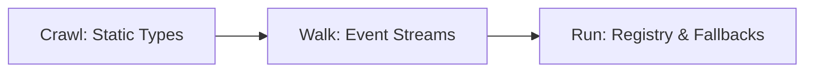
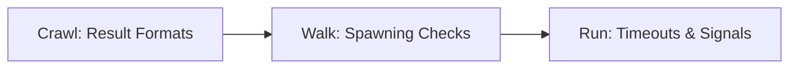
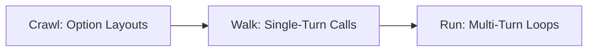
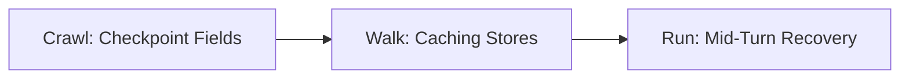
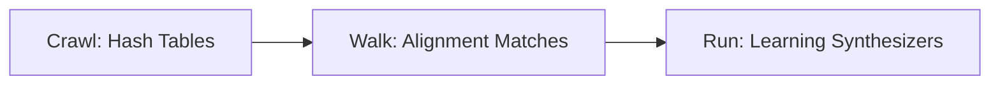

# Plan: Increase Test Coverage of `pi-mojo` Core Packages

This document defines a progressive roadmap to systematically improve the test coverage of the five core packages located in `src/packages/`. The plan excludes progressive examples and end-to-end storyboards, focusing entirely on native system compiler stability and package safety.

For each package, the roadmap is divided into three distinct phases:
* **Crawl**: Basic unit testing of configurations, static structures, FFI initialization, and simple type conversions.
* **Walk**: Functional testing of internal state machines, standard system operations, mock integrations, and standard execution paths.
* **Run**: Complex system testing targeting asynchronous boundaries, edge-case recovery, execution timeouts, FFI failures, and robust concurrent operations.

---

| Core Package | Component Modules | Baseline Statements | Covered Statements | Actual Baseline Coverage | Target Coverage |
| :--- | :--- | :---: | :---: | :---: | :---: |
| **`packages/ai`** | Types, Basic, Messages, Content, Providers, Registry, Streams | 4,898 | 143 | **2.92%** | 75% |
| **`packages/coding_agent`** | Bash Executor, Process Exec, Result structures | 1,512 | 66 | **4.37%** | 80% |
| **`packages/agent`** | Options, Contexts, Loops, Tool Results | 3,688 | 118 | **3.20%** | 70% |
| **`packages/durable`** | Checkpoint Store, Durable Loops | 153 | 42 | **27.45%** | 85% |
| **`packages/playbook`** | Playbook Store, Playbook Agents | 227 | 90 | **39.65%** | 75% |
| **TOTAL** | **Combined Core** | **10,478** | **447** | **4.27%** | **75%** |

---

## 📦 Detailed Per-Package Coverage Roadmap

### 1. `packages/ai` (AI Interfaces and Registry)
This package defines the unified API provider registry, event streams, and LLM communication payloads.

* **Crawl Phase (Target: 80% on types)**:
  * Validate all fields, initializers (`__init__`), and copy constructors for `ThinkingBudgets`, `Usage`, `UserMessage`, `Tool`, `Context`, `TextContent`, and `ImageContent`.
  * Verify dynamic Python dictionary conversions (`to_py()` / dynamic initialization from FFI structures) to ensure no buffer overflow or dynamic typing issues.
* **Walk Phase (Target: 65% on streams)**:
  * Test token count estimations (`estimateTokens`) and string slice heuristics.
  * Implement functional tests for `createAssistantMessageEventStream` utilizing mock JSON buffers.
  * Verify parsing of thinking and text block chunks inside streaming structures.
* **Run Phase (Target: 75% package-wide)**:
  * Test dynamic registration/unregistration mechanisms inside `ApiProviderRegistry` to prevent race conditions during concurrent test executions.
  * Validate fallback routing layers (`OpenRouterRouting`, `VercelGatewayRouting`) under simulated network latencies and API transport failures.

---

### 2. `packages/coding_agent` (Subprocess and Execution Managers)
This package manages dynamic process spawning and system-level terminal interactions.

* **Crawl Phase (Target: 90% on models)**:
  * Verify initializers and field mapping for `BashResult` and `ExecResult` structures.
  * Validate JSON conversion of exit codes, termination signals, and output text streams.
* **Walk Phase (Target: 75% on standard runs)**:
  * Execute standard system commands (e.g. `ls`, `pwd`, `echo`) under the sandboxed workspace, asserting output matches precisely.
  * Test directory constraint checks (spawning processes with custom CWD values) and environment variables configuration maps.
* **Run Phase (Target: 80% package-wide)**:
  * Test command cancellation triggers and dynamic output truncation limits during high-volume output runs to verify memory leak safety.
  * Simulate system execution timeouts, verifying process groups are killed and resources cleaned up.

---

### 3. `packages/agent` (Agent Loop and Callback Engine)
The main systems-agent state controller and execution loop interface.

* **Crawl Phase (Target: 80% on structures)**:
  * Validate option constraints (`AgentOptions`) and context configurations.
  * Test initializers and fields for callback payloads (`BeforeToolCallResult`, `AfterToolCallResult`, `AgentLoopTurnUpdate`).
* **Walk Phase (Target: 60% on state)**:
  * Build isolated unit tests for single-turn executions targeting faux model providers.
  * Assert callback triggers (`beforeToolCall`, `afterToolCall`) fire in the correct sequence.
* **Run Phase (Target: 70% package-wide)**:
  * Test multi-turn loop resilience, validating retry delays and backoff multipliers under API throttling.
  * Verify agent steering parameters and dynamic context truncation during lengthy multi-turn conversations.

---

### 4. `packages/durable` (Durable State Checkpoints)
Enables agent crash recovery by checkpointing iteration states directly to the disk.

* **Crawl Phase (Target: 90% on serialization)**:
  * Test validation and binary serialization of `Checkpoint` data models.
  * Verify timestamp and iteration index serialization integrity.
* **Walk Phase (Target: 80% on filesystem)**:
  * Validate checkpoint file creation, cache rotation limits, and recovery search indexes inside `CheckpointStore`.
  * Ensure directory safety by sandbox-restricting target cache directories.
* **Run Phase (Target: 85% package-wide)**:
  * Trigger mock system aborts mid-iteration and assert `DurableAgent` restores its entire context history and resumes processing.
  * Verify recovery performance under heavy message payloads.

---

### 5. `packages/playbook` (Command Learning and Alignment)
Optimizes agent iterations by matching commands against local success databases.

* **Crawl Phase (Target: 85% on models)**:
  * Verify initialization, file caching, and integrity checking in `PlaybookStore`.
* **Walk Phase (Target: 70% on matching)**:
  * Test the alignment algorithm, asserting instruction hashes and similar command scripts map to appropriate playbook records.
* **Run Phase (Target: 75% package-wide)**:
  * Simulate full playbook acquisition sequences: execute a task, capture success, synthesize a playbook schema, write to disk, and verify subsequent runs load and align to it.
