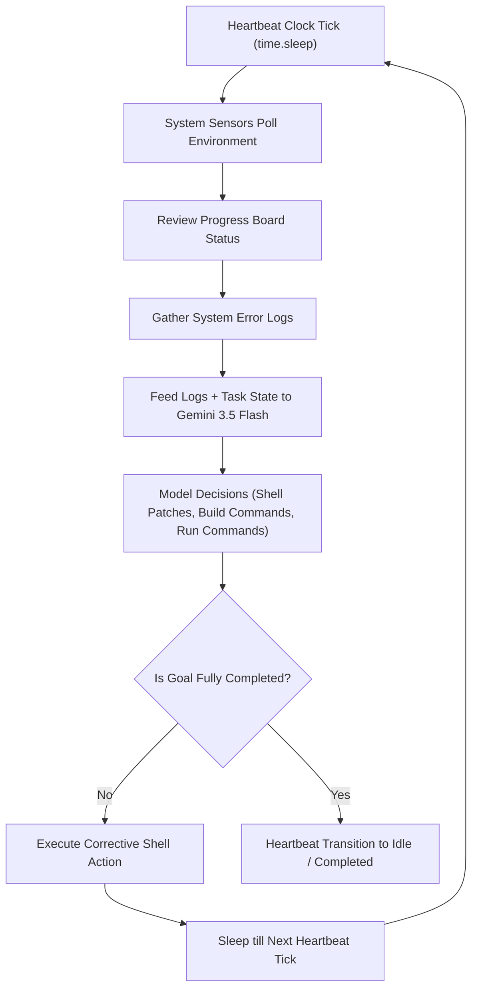

# Towards Full-Fledged Agentic Loops (example_full_fledged_agent.mojo)

This example demonstrates how to build a **background-ticking autonomous agent loop**—moving from a synchronous, reactive design toward a full systems daemon. 

Instead of waiting passively for user commands, a background agent uses a **ticking heartbeat** to periodically inspect the workspace state, monitor compile failures or runtime tests, and dynamically plan the next self-correcting action until all task objectives are successfully met.

---

## 💓 Architectural Design Pattern

In standard systems programming, a background ticking daemon polls filesystems, process IDs, and environment outputs. Integrating an LLM as the "brain" of this heartbeat loop allows for autonomous problem-solving and self-healing systems development.



### 📋 Key Components

1. **Heartbeat Clock (`time.sleep` intervals)**: Drives the autonomous daemon cycle. The agent wakes up on every tick, performs analysis, and returns to sleep.
2. **Environment Sensors**: Reads filesystem paths and captures compilation error messages dynamically.
3. **Virtual Progress Board**: Tracks high-level states (e.g., `Env Diagnostics`, `Compile Project`, `Run Test Suite`) that the agent updates dynamically based on system state sensors.
4. **Self-Healing Action dispatch**: The agent uses Gemini 3.5 Flash to automatically interpret build errors, patch files (e.g., fixing code syntax errors), compile executables, and run validation test suites without human intervention.

---

## 🚀 How to Run the Example

### 1. Fully Autonomous Mode
Run the daemon in fully autonomous background mode. The agent checks system health, notices a compiler syntax error, patches it, recompiles, runs tests, and completes:

```bash
mojo -I src examples/example_10_full_fledged_agent/example_full_fledged_agent.mojo
```

### 2. Interactive Daemon Confirmation
Run with the `--interactive` or `-i` flag to inspect each background heartbeat tick. This allows you to verify proposed commands, skip steps, or type custom feedback/corrections to steer the agent:

```bash
mojo -I src examples/example_10_full_fledged_agent/example_full_fledged_agent.mojo --interactive
```

---

## 🔍 Code Walkthrough

### 📄 Source Code & Captured Run
- **Source Code**: [example_full_fledged_agent.mojo](example_full_fledged_agent.mojo)
- **Sample Run Output**: [example_full_fledged_agent_run.txt](example_full_fledged_agent_run.txt)

### 1. Robust Stdout Interop
To prevent terminal stdout buffering from holding back prompts in interactive environments, we define a standard flushing interop helper:
```mojo
def get_input(prompt: String) raises -> String:
    var py_sys = Python.import_module("sys")
    var builtins = Python.import_module("builtins")
    _ = py_sys.stdout.flush()
    return String(builtins.input(prompt))
```

### 2. The Heartbeat Polling Loop
The background tick loop is driven by a time-controlled polling sequencer:
```mojo
    for tick in range(1, max_ticks + 1):
        _ = time_mod.sleep(delay_seconds)
        utils.console_log("\n💓 [Tick " + String(tick) + "] Heartbeat Active: Checking task status...")
```

### 3. State Diagnostics & Self-Healing Command Output
The agent gathers workspace statistics. On a compiler error, the LLM determines how to correct it:
```mojo
            var system_prompt = (
                "You are an autonomous background-ticking systems agent. You drive tasks to completion.\n"
                "Review the virtual task board status and the system sensor diagnostics.\n"
                "Propose exactly one shell command to execute next to resolve issues and make progress."
            )
```
The agent executes the generated command natively (or simulates execution in mock mode), patches the workspace, recompiles, runs the test suite, and completes automatically.
