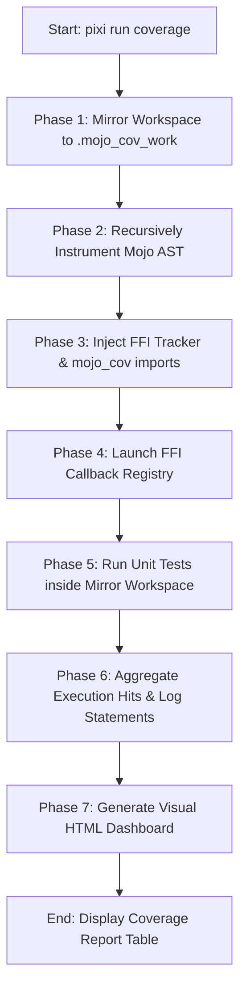

# 🪄 mojo-test-cov: AST-Based Statement Coverage Suite for Mojo

`mojo-test-cov` is a high-performance offline statement coverage instrumenter, test execution runner, and interactive visual reporter specifically designed for **Mojo** packages.

It enables native Mojo projects to measure statement-level execution coverage precisely, using automated Abstract Syntax Tree (AST) token classification and low-overhead Python FFI tracking callbacks.

---

## 🚀 Key Features

* **Isolated Workspace Mirroring**: Copies the entire codebase into a virtualization folder (`.mojo_cov_work/`) to guarantee safety and preserve original source trees.
* **AST-Based Statement Classification**: Detects executable lines while ignoring comments, imports, structure definitions, and block delimiters.
* **Token-Level Parentheses Nesting**: Counts parentheses, brackets, and brace boundaries to ignore multi-line statement continuations and avoid JIT syntax errors.
* **Triple-Quote Docstring Tracking**: Tracks string block boundaries to ignore multi-line comments and text literals.
* **Exception-Safe FFI Callbacks**: Wraps FFI tracking hooks in exception-handling structures so that coverage collection does not interfere with throwing functions marked with `raises`.
* **Subprocess Execution Aggregation**: Merges runtime hits into a unified database file (`.coverage_mojo.json`) allowing coverage reports to accumulate metrics across multiple independent test suite files.
* **Interactive Visual Dashboard**: Generates comprehensive visual dashboards inside `coverage_html/` highlighting covered, uncovered, and non-executable lines.

---

## 🏗️ Architecture & Workflow

The coverage analyzer processes files through a highly structured pipeline:



### Phase-by-Phase Breakdown

#### 1. Workspace Virtualization
To ensure the developer's working files are not modified directly, the runner clones files to `.mojo_cov_work/`. Specific directories (such as `.git`, `.pixi`, `build`, `coverage_html`) are ignored. All file copies preserve path structures so that relative imports resolve correctly.

#### 2. AST-Based Parsing and Instrumentation
Every target `.mojo` and `.🔥` file inside the virtual workspace is scanned. The parser reads lines, tracks active indentation scopes, and scans for block headers and statement boundaries. It injects a tracker call:
```mojo
_cov.hit("file_path", line_number)
```
immediately preceding the statement.

#### 3. Exception-Safe FFI Callback Channels
Because Mojo requires strict compile-time signature compliance, the tracking module loads a light Python helper interface. Each injected callback is wrapped inside local try-except blocks to prevent runtime FFI errors from causing target process termination.

#### 4. Test Run Execution
The runner executes the target test suite under the `.mojo_cov_work/` workspace using the native compiler:
```bash
mojo run -I src tests/test_packages.mojo
```
As statements are reached, the FFI callbacks execute, recording hits in a shared Python dictionary in memory.

#### 5. Coverage Database Saving
On compiler exit (or on explicit completion of the test's `main()` block), the tracking runner writes results into the `.coverage_mojo.json` database. If database files exist, new hits are merged to accumulate stats.

#### 6. Visual Dashboard Generation
The reporter parses the compiled database against source files and builds interactive visual HTML pages representing line execution states.

---

## 🛠️ File-by-File Component Reference

### 1. [runner.py](file:///Users/amund/pi-mojo/src/mojo-contrib/mojo-test-cov/runner.py)
The primary orchestration engine.
* Creates the target `.mojo_cov_work/` directory.
* Automatically replicates project layout and copies core files.
* Recursively walks source packages (`src/packages/`) and test suites (`tests/`).
* Runs target test suites in subprocesses.
* Feeds final database files to the reporter.

### 2. [instrumenter.py](file:///Users/amund/pi-mojo/src/mojo-contrib/mojo-test-cov/instrumenter.py)
The parser and statement hook injector.
* **`is_executable_line(line: str) -> bool`**: Analyzes string characters. Skips empty lines, comment lines starting with `#`, package imports (`import`, `from`), structure declarations (`struct`, `class`, `trait`), function definitions (`fn`, `def`), and bare closing tokens (`)`, `]`, `}`, `pass`).
* **`instrument_file(...)`**: Scans files. Tracks triple-quoted string boundaries (`"""` and `'''`) to avoid modifications inside multi-line blocks. Detects functional entry points and tracks local scopes via indentation.
* **`flush_function_body(...)`**: Injects `var _cov = MojoCov()` inside functions. Tracks open-and-close brackets to calculate parenthesis nesting levels. Only inserts hooks for top-level statement starting lines, bypassing continuations. If the function is `main()`, it appends `_cov.save()` to flush database logs.

### 3. [cov_tracker.py](file:///Users/amund/pi-mojo/src/mojo-contrib/mojo-test-cov/cov_tracker.py)
The runtime shared memory database.
* Spawns a singleton `MojoCoverageTracker` inside the active Python runtime process.
* **`log(file_path: str, line_number: int)`**: Receives hit callbacks and records executing line indices inside set registers.
* **`save()`**: Merges in-memory statistics with existing `.coverage_mojo.json` data, protecting against data loss across multiple test executions. Standard registration is bound to `atexit` to handle clean compiler teardown automatically.

### 4. [mojo_cov.mojo](file:///Users/amund/pi-mojo/src/mojo-contrib/mojo-test-cov/mojo_cov.mojo)
The native Mojo interface to Python callbacks.
* Appends standard search paths (`.` and `src`) to the Python path dynamically during initializer runs.
* Calls `cov_tracker.get_tracker()` to acquire references to the memory registry.
* Exposes `hit(...)`, `register_exec(...)`, and `save()` wrapping FFI conversions inside exception blocks.

### 5. [reporter.py](file:///Users/amund/pi-mojo/src/mojo-contrib/mojo-test-cov/reporter.py)
The results parser and HTML compiler.
* Prints a summary execution table directly inside the CLI terminal.
* Calculates statistics: Total Executable Statements, Covered Statements, and Overall Coverage rates.
* Compiles `index.html` displaying aggregate progress bars and search tables listing source files.
* Compiles separate `<file_name>.html` detail pages highlighting individual line execution statuses.

---

## 💻 Command Line Usage

### Execution inside the workspace using Pixi:
```bash
pixi run coverage
```

### Raw CLI Invocation:
Run the coverage orchestrator manually by specifying source directories and test scripts:
```bash
python src/mojo-contrib/mojo-test-cov/runner.py \
  --source src/packages \
  --test tests/test_packages.mojo \
  --output-dir coverage_html
```

### CLI Arguments:
* `--source`: Directory containing target packages to measure (default: `src/packages`).
* `--test`: Test suite or file to execute (default: `tests/test_packages.mojo`).
* `--output-dir`: Output location for visual dashboards (default: `coverage_html`).

---

## 📝 Code Instrumentation Visual Demonstration

### Target Original Mojo Code:
```mojo
fn calculate_ratio(a: Int, b: Int) raises -> Float64:
    # Check if division is safe
    if b == 0:
        return 0.0
    
    var res = Float64(a) / Float64(b)
    return res
```

### Instrumented Code under `.mojo_cov_work/`:
```mojo
from mojo_cov import MojoCov

fn calculate_ratio(a: Int, b: Int) raises -> Float64:
    var _cov = MojoCov()
    # Check if division is safe
    if b == 0:
        _cov.hit("src/packages/math/pi_math.mojo", 3)
        return 0.0
    
    _cov.hit("src/packages/math/pi_math.mojo", 6)
    var res = Float64(a) / Float64(b)
    _cov.hit("src/packages/math/pi_math.mojo", 7)
    return res
```

---

## 🎨 Visual Report Styles

The visual reporter dashboard outputs a dark themed style using responsive CSS components and Google fonts:

* 🟢 **Covered Line (`.line.covered`)**: Colored green with a solid emerald border accent to show verified execution path lines.
* 🔴 **Missed Line (`.line.uncovered`)**: Colored red with a solid crimson border accent highlighting statement paths that were never hit during tests.
* ⚪ **Non-Executable Line (`.line`)**: Transparent/White layout representing comments, structural borders, JIT signatures, and definitions.

---

## ⚠️ Edge Cases, Limitations, and Compiler Constraints

### 1. Parentheses and Multi-Line Continuations
Mojo syntax permits splitting function calls or data arrays across multiple lines. To prevent the instrumenter from injecting hooks inside the middle of a continuous expression (which would trigger compilation failures), the token parser checks nesting balances. No tracking hooks are added until nesting returns to zero.

### 2. JIT Compiler Symbol Collisions
In JIT compilation runs, attempts to pass custom native structures (like Mojo's `Context` or memory pointers) directly across the Python FFI boundary inside user scopes can result in compiler errors (`KGEN_CompilerRT_GetOrCreateGlobalIndexed`).
To bypass JIT symbol issues:
* Native tests should call intermediate API points (such as `provider.streamSimple(...)`) which manage JIT conversions internally.
* Keep tracking hooks focused on basic structural variables (Strings and Integers) when interacting with FFI libraries.

### 3. File Encoding
Ensure source files use clean UTF-8 encoding. The instrumentation script reads and writes using UTF-8 flags to avoid characters rendering problems on multi-platform terminals.
